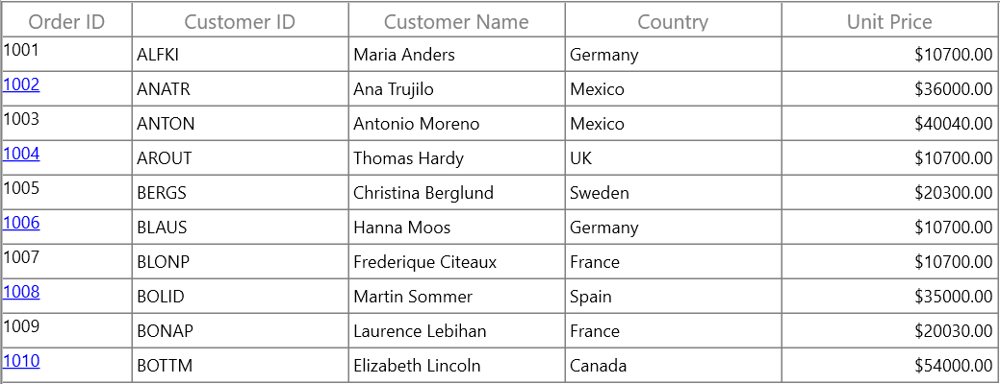

# How to Display Few Cells of a Columns have Different Foreground Along with Underline Based on a Condition in WPF DataGrid?

This sample show cases how to apply the conditional styling for grid columns in [WPF DataGrid](https://www.syncfusion.com/wpf-controls/datagrid) (SfDataGrid).

You can apply the conditional styling for [GridColumn](https://help.syncfusion.com/cr/wpf/Syncfusion.UI.Xaml.Grid.GridColumn.html) by using converter and [CellTemplate](https://help.syncfusion.com/cr/wpf/Syncfusion.UI.Xaml.Grid.GridColumnBase.html#Syncfusion_UI_Xaml_Grid_GridColumnBase_CellTemplate) in `DataGrid`.

#### XAML
```xml
<Window.Resources>
    <local:WbsElementToHyperLinkConverter x:Key="WbsElementToHyperLinkConverter"/>
</Window.Resources>

<syncfusion:GridTextColumn MappingName="OrderID" HeaderText="Order ID" AllowFiltering="False" MinimumWidth="10" Width="90" >
    <syncfusion:GridTextColumn.CellTemplate>
        <DataTemplate>
            <TextBlock  Text="{Binding Path=OrderID}"  
            TextDecorations="{Binding Converter={StaticResource WbsElementToHyperLinkConverter},ConverterParameter=TextDecorations}"  
            Foreground="{Binding Converter={StaticResource WbsElementToHyperLinkConverter},ConverterParameter=ForeGround}" />
        </DataTemplate>
    </syncfusion:GridTextColumn.CellTemplate>
</syncfusion:GridTextColumn>
```

#### C#
```c#
public class WbsElementToHyperLinkConverter : IValueConverter
{
    public object Convert(object value, Type targetType, object parameter, CultureInfo culture)
    {
        var data = value as OrderInfo;
        if (data.OrderID % 2 == 0)
        {
            if (parameter.ToString() == "TextDecorations")
                return TextDecorations.Underline;
            else
                return new SolidColorBrush(Colors.Blue);
        }
        else
            return value;
    }

    public object ConvertBack(object value, Type targetType, object parameter, CultureInfo culture)
    {
        throw new NotImplementedException();
    }
}
```


